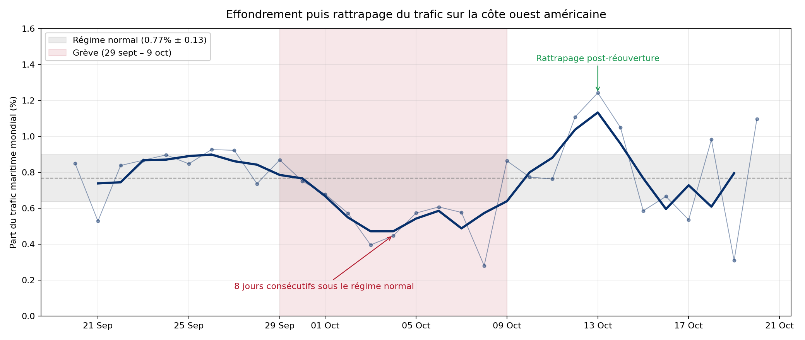

# stage-lip6 : Résilience du réseau maritime mondial

Stage réalisé au **LIP6**, équipe **ComplexNetworks**.
Encadrement : **Owen Crabtree** , **Matthieu Latapy**.

Reconstruction du trafic maritime mondial sous forme de **flot de liens** (*stream graph*)
à partir de données de séjours de navires, et mesure de l'effet d'une perturbation
portuaire majeure : le lock-out des ports de la côte ouest américaine d'octobre 2002.

## Question de recherche

> **À quelle échelle d'observation une perturbation portuaire localisée devient-elle
> détectable dans un réseau maritime mondial ?**



J'ai choisi le formalisme des flots de liens de Matthieu Latapy parce qu'il permet de
représenter un réseau dont les liens existent sur des intervalles de temps plutôt que
de façon permanente : c'est exactement la nature d'un trajet maritime, actif du départ
jusqu'à l'arrivée. Une série de graphes statiques imposerait de choisir a priori une
fenêtre d'agrégation et perdrait la chronologie à l'intérieur de chaque fenêtre.

Le lock-out de 2002 sert ici d'instrument de mesure : c'est une perturbation
dont la date, la durée et le périmètre géographique sont connus indépendamment
des données. On peut donc évaluer ce qu'une métrique donnée détecte ou ne détecte
pas, plutôt que d'interpréter une variation dont on ignore la cause.


## Le cas d'étude : le lock-out ILWU de 2002

La convention collective entre l'ILWU (syndicat des dockers) et la PMA (association
patronale) expire le **1er juillet 2002**. Le **26 septembre**, le syndicat lance une
grève du zèle ; le **27 septembre**, la PMA riposte en verrouillant les **29 ports de la
côte ouest**, mettant à l'arrêt 10 500 dockers. Le **8 octobre**, le président Bush
invoque le Taft-Hartley Act ; le **9 octobre**, une injonction fédérale ordonne la
réouverture.

Il s'agit donc d'un **lock-out patronal**, et non d'une grève : c'est la première fois
que le Taft-Hartley servait à briser un lock-out plutôt qu'un mouvement syndical.

## Données

Données commerciales de mouvements de navires, acquises auprès d'un assureur maritime.
**Elles ne sont pas redistribuables** : le dossier `data/` est exclu du dépôt, de même
que les fichiers intermédiaires de `data_clean/`.

| Fichier attendu dans `data/` | Contenu |
|---|---|
| `2002_MOVES.csv` | Séjours de navires (arrivée, appareillage, navire, port) |
| `Matching_ports_city1_city2.xlsx` | Référentiel des ports : nom, pays, coordonnées, type |

Après nettoyage, l'année 2002 compte **876 840 séjours** valides.

**Couverture temporelle.** La collecte 2002 est **mensuelle et partielle** : seuls
février-mars, juin, septembre-octobre et décembre sont renseignés, soit **50 % de
l'année**. La séparation est nette : 184 jours à exactement zéro escale, 181 jours à
plus de mille, et aucun jour entre les deux. Les périodes non collectées apparaissent
comme des effondrements sur les figures de métriques globales ; il s'agit d'un artefact
de collecte, pas d'un phénomène.

## Approche

Le pipeline enchaîne cinq étapes, orchestrées par `main.py`.

Le pipeline est paramétré par année et a été validé sur deux jeux de nature différente :
2002 (877 000 mouvements, format CSV, dates textuelles) et 2010 (303 000 mouvements,
format xlsx, dates natives). Le passage de l'un à l'autre ne demande aucune modification
du code.

**1. Nettoyage** (`src/clean.py`) : lecture des séjours bruts, conversion des dates,
calcul des durées de séjour, jointure avec le référentiel des ports.

**2. Clustering spatial** (`src/cluster.py`) : les points portuaires voisins (mouillages,
terminaux, petits ports) sont agrégés en zones par classification hiérarchique
*complete linkage* sur des distances de Haversine. Rayon de coupure : **44 km**, soit les
24 milles nautiques de la zone contiguë au sens de la convention UNCLOS. Les ports
dépassant **0,5 % du trafic mondial** restent des nœuds autonomes.

**3. Reconstruction du flot de liens** (`src/reconstruct.py`) : pour chaque navire, deux
séjours consécutifs forment un lien daté entre deux zones. Un lien n'est retenu que si le
transit dure au plus **Δt = 30 jours**.

**4. Métriques réseau** (`src/metrics.py`) : densité temporelle δ(t), c'est-à-dire le
nombre de liens actifs à chaque instant, et composantes connexes du graphe agrégé sur des
fenêtres de **14 jours**.

**5. Analyse d'impact** (`src/analyse_greve_2002.py`) : part du trafic mondial captée par
les 9 principaux ports ILWU, comparaison à un groupe témoin, et confrontation du rythme
des départs à celui des arrivées.

Les hyperparamètres sont rassemblés dans `src/config.py`.

## Installation

Python 3.10 ou supérieur (développé et testé sous 3.14).

```powershell
python -m venv .venv
.venv\Scripts\activate

# Si PowerShell bloque l'activation :
# Set-ExecutionPolicy -ExecutionPolicy RemoteSigned -Scope CurrentUser

python -m pip install -r requirements.txt
```

Placer ensuite les deux fichiers de données dans `data/`.

## Utilisation

Depuis la racine du projet :

```powershell
# Pipeline complet
python main.py --year 2002

# Une étape isolée
python main.py --year 2002 --step cluster

# Autre seuil de transit
python main.py --year 2002 --delta-t 45
```

Étapes disponibles : `clean`, `cluster`, `reconstruct`, `metrics`, `impact`, `all`.

Deux scripts s'exécutent séparément :

```powershell
# Justification du choix de Δt
python -m src.exploration_transit

# Matrice de sensibilité du clustering (recalcule 20 combinaisons, ~90 s)
python -m src.figure_sensibilite

# Cartes interactives (nécessite folium et searoute)
python -m src.carte
```


## Structure du dépôt

```
stage-lip6/
├── main.py                      # Orchestrateur du pipeline (CLI)
├── requirements.txt
├── src/
│   ├── config.py                # Chemins et hyperparamètres
│   ├── clean.py                 # 1. Nettoyage et jointure référentiel
│   ├── cluster.py               # 2. Clustering spatial des ports
│   ├── reconstruct.py           # 3. Construction du flot de liens
│   ├── metrics.py               # 4. Densité temporelle et connexité
│   ├── analyse_greve_2002.py    # 5. Étude de cas ILWU
│   ├── exploration_transit.py   # Justification empirique de Δt
│   ├── figure_sensibilite.py    # Matrice de sensibilité du clustering
│   └── carte.py                 # Cartes interactives (folium + searoute)
├── data/                        # Données brutes : non versionnées
├── data_clean/                  # Intermédiaires Parquet : non versionnés
├── results/                     # Tables de résultats (CSV, Parquet)
└── reports/figures/             # Figures produites
```

## Résultats principaux

 - **Connexité, échelle globale : désagrégation nécessaire.** Sur les 10 fenêtres de 14 jours intégralement
   collectées, la composante géante rassemble toujours au moins **99,1 %** des nœuds, y
   compris la fenêtre du 27 septembre au 10 octobre où le réseau ne forme qu'une seule
   composante contenant 100 % des nœuds.
 - **Densité, échelle globale : désagrégation nécessaire.** δ(t) ne marque aucune inflexion pendant la
   fermeture.
   
    Ces deux résultats négatifs justifient la descente d'échelle : la perturbation représente
    environ 1 % du trafic mondial observé et se dilue dans toute métrique agrégée. L'analyse
    doit donc se restreindre aux ports effectivement touchés.

 - **Part de trafic, échelle des ports touchés : visible.** La part du trafic mondial
   captée par les 9 ports ILWU recule de 20 à 33 % selon la fenêtre retenue contre trois
   groupes témoins, l'effet net va de −14 % à −31 % :  mais le signe est robuste, les ports ILWU étant les seuls à reculer.
   Les groupes témoins retenus sont les terminaux pétroliers de la côte Ouest.
 - **Départs contre arrivées : le mécanisme.** En régime normal les deux flux
   s'équilibrent (41,0 arrivées et 38,8 départs par jour). Pendant la fermeture, les
   **départs reculent de 47 % contre 25 % pour les arrivées** : les navires déjà en mer avant le lockout
   continuent d'accoster sans pouvoir repartir, ou plus difficilement.
 - **Choix de Δt.** Sur 832 479 transits, 90,7 % durent 20 jours ou moins. Δt = 30 jours
   se situe juste sous le premier pic d'artefacts de censure, à 31 jours, qui correspond
   au mois de novembre non collecté.

## Limites et perspectives

 - **Connexité temporelle.** Les composantes sont calculées sur des graphes agrégés par
   fenêtres de 14 jours, ce qui diminue l'apport du formalisme de flot de liens dans cette partie. La
   mesure pertinente serait la connexité *temporelle* : existe-t-il un chemin respectant
   l'ordre chronologique entre deux ports, et avec quelle latence ?
 - **Pas de test statistique "formel".** Les écarts sont décrits, non testés ; les séries
   journalières sont autocorrélées, ce qui interdit un test naïf.
 - **Contrefactuel 2010 non construit.** L'année témoin sans crise n'a jamais été
   comparée à 2002 sur la même fenêtre calendaire à cause des différences de données. ( par exemple 2002 comporte octobre mais pas 2010)
 - **Couverture partielle.** La moitié de 2002 manque, ce qui interdit toute lecture
   saisonnière/périodique et réduit δ(t) à quelques plateaux exploitables.

## Références

Latapy, M., Viard, T., Magnien, C. (2018). *Stream Graphs and Link Streams for the
Modeling of Interactions over Time*. Social Network Analysis and Mining, 8(1).
